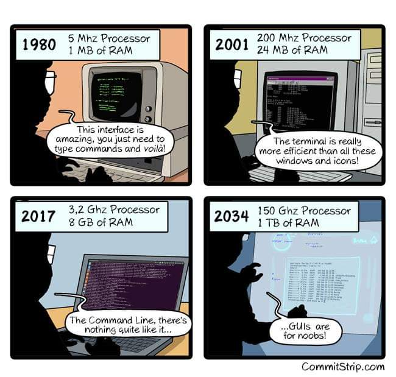
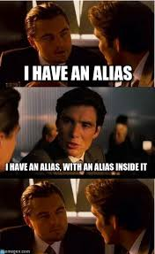

<div align="center">
    <h1>Gettings Started</h1>
    
</div>
<br/>

## Basic unix commands
| Command | Explanation |
| ------- | ----------- |
| <code>pwd</code> | "presentworkingdirectory" or "Where am 1?" |
| <code>cd <NAMEOFDIRECTORY> </code> | change directory |
| <code>clear</code> | clear the console |
| <code>ls </code> | List directory files and foldersin a horizontal view |
| <code> ls -la </code> | list all files, folders and hidden files and associated information |
| <code>touch [FILENAME]</code>  | create a file |
| <code>mkdir [DIRNAME]</code>  | create a directory |
| <code>rm [FILENAME]</code> | I removes a file |
| <code>rm -R [DIRNAME]</code> |I remove a directory and its contents recursively |
| <code>cat [FILENAME] </code> | I return a file's content to the commandline(strout) |
| <code>vim [FILENAME] </code> | open a file in VIM to edit or view |

&nbsp;
## An example alias command

```zsh
alias cl="clear"
```
*This will create a shortened version of te clear command.* 

&nbsp;
## Use an alias inside an alias
```zsh
alias l="cl; ls -la -G"
```
*uses the clear Alias, then lists all files, folders and hidden files and associated information. (in color!)*

<div align="center">
     
</div> 

&nbsp;

---
NEXT: [Creating an alias](01_creating_an_alias.md)
