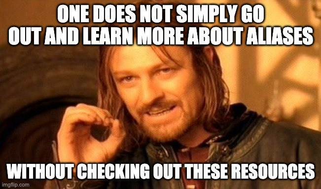

    <h1>Awesome shell/slias resources<h1> 
     

 

- [Example bash_profile](../assets/images/example_profile.txt)
- [30 Handy Bash Shell Aliases For Linux / Unix / MacOS](https://www.cyberciti.biz/tips/bash-aliases-mac-centos-linux-unix.html)
- [Bash aliases you can’t live without](https://opensource.com/article/19/7/bash-aliases)
- [linuxcommand.org](http://www.linuxcommand.org/)
- [Linux Documentation Project Guides](https://tldp.org/guides.html)
- [Bash Hackers Wiki](https://wiki.bash-hackers.org/start)
- [BashFAQ](http://mywiki.wooledge.org/BashFAQ?action=show&redirect=BashFaq)

---

BACK: [Creating more aliases](02_creating_more_alias.md)
